# YieldCurve-Network

## Overview

The goal of this project is to expose the **structure of a sovereign / issuer yield-curve panel as a multi-layer network**. A curve panel is inherently two-dimensional — every observation belongs to both an *issuer* and a *maturity term* — and collapsing it into a single correlation network throws one of those dimensions away. This tool keeps both: it slices the panel along one axis into a stack of network *layers*, links the shared nodes across those layers, and analyses the stack as a single multiplex.

The system reads a **wide** curve table: one row per `(date, issuer)` and one numeric column per maturity term. This is the natural storage layout for curve data and the shape of the `par_rates` / `zero_rates` tables it was built against. The wide→long reshape, and the decision about which column plays which role, are handled automatically — there are no node-name or series-value pickers to get wrong.

A curve panel admits exactly two layerings, and the **Network Type** dropdown chooses between them:

| Network type | Layers are… | Nodes are… | Answers |
|---|---|---|---|
| **Issuer Network by Term** | maturity terms (0.5Y, 1Y, … 30Y) | issuers (DE, FR, IT, …) | *Which issuers co-move, and does that grouping change along the curve?* |
| **Term Network by Issuer** | issuers | maturity terms | *How does the curve hang together, and does its internal structure differ by issuer?* |

Inter-layer edges connect the same node across every layer it appears in, so the multiplex captures both within-layer co-movement and the cross-layer identity of a node.

Transformations (can be user supplied in the API) and/or filtering through SQL allow for the user to analyze transformed data and time/sector slices in complex ways.

If you are looking for a more generic network based exploration of datasets (i.e. not focussed on yield curves) with a similar functionality check out [https://github.com/FulgentMcGuffin/tgraphportfolio](https://github.com/FulgentMcGuffin/tgraphportfolio).


### Methods Covered

1. **Automatic panel detection**: Infers the issuer column and the set of term columns from the table schema; parses maturity labels (`0.5Y`, `10Y`, `6M`, and the zero-padded `Y000p5` form) so every axis in every plot is ordered by maturity rather than alphabetically.
2. **Pluggable Data Transforms**: Node-wise preprocessing — currently daily simple returns — applied *per layer*, which is the only correct order for a per-node operation.
3. **Selectable Pairwise Connection Measures**:
   - **Distance Correlation**: Captures both linear and non-linear associations without assuming monotonic relationships.
   - **Pearson Correlation**: Evaluates standard linear correlation.
   - **Spearman Correlation**: Measures monotonic rank-based relationships.
   - **Kendall Tau**: Rank-based correlation robust to ties and small samples.
   - **Shrinkage Correlation (Ledoit-Wolf)**: Denoised Pearson correlation via Random Matrix Theory; stabilizes estimates when samples ≈ nodes — the common case for a short window over a curve panel.
   - **Conditional Correlation**: Correlation computed only on high-magnitude move days; captures stress-regime linkage distinct from calm-period correlation.
   - **Mutual Information**: Non-linear, non-monotonic dependence detector; entropy-based measure of shared information.
   - **Chatterjee ξ**: Rank-based test for any dependence; computationally cheap alternative to distance correlation.
   - **Maximal Correlation (ACE)** *(optional, see below)*: Alternating Conditional Expectations, finding nonparametric transformations that maximize correlation.
4. **Graph Construction and Thresholding**: Prunes weak connections using a user-defined independence threshold to build weighted `NetworkX` graphs, one per layer.
5. **Multiplex Assembly**: Stacks the per-layer graphs into one graph whose vertices are `(node, layer)` pairs, joining each node to itself across every pair of layers it occurs in.
6. **Manual Cell Selection**: A mouse-driven term × issuer grid for including or excluding individual `(term, issuer)` series before the networks are built — ragged coverage is the norm in curve data, and this makes it explicit rather than implicit.
7. **Multi-Layer Metrics and Community Detection**: Per-layer intra/inter edge composition, a node × layer centrality heatmap, and per-layer community detection (ASE + KMeans) with Jaccard alignment so a community ID means the same group of nodes in every layer.
8. **Interactive 3D Multiplex Visualization**: A rotatable Plotly stack, one plane per layer, with layer toggling and click-through to a node table.
9. **Nelson-Siegel Residual Networks**: Strips the fitted curve from each issuer and networks the idiosyncratic remainder — one network per component network — charted with user-selectable y / shape / fill / size aesthetics.
10. **Temporal Evolution**: Rebuilds the multiplex in every rolling window and tracks its edge composition, the community count chosen by each of five k-selection methods, Nelson-Siegel factor trajectories with regime classification, and correlation-stress indicators.

## Quickstart

Requires [uv](https://docs.astral.sh/uv/) and Python 3.13+.

```bash
uv sync
uv run ycn-gui
```

Point the sidebar at a DuckDB or SQLite file. If the database contains a table called `par_rates` it is selected automatically, as is a column called `date`. Otherwise, choose your relevant columns. Choose a **Network Type**, optionally narrow the data, then click **Build network**.

| Issuer MLN by Term | Term MLN by Issuer |
|:---:|:---:|
| 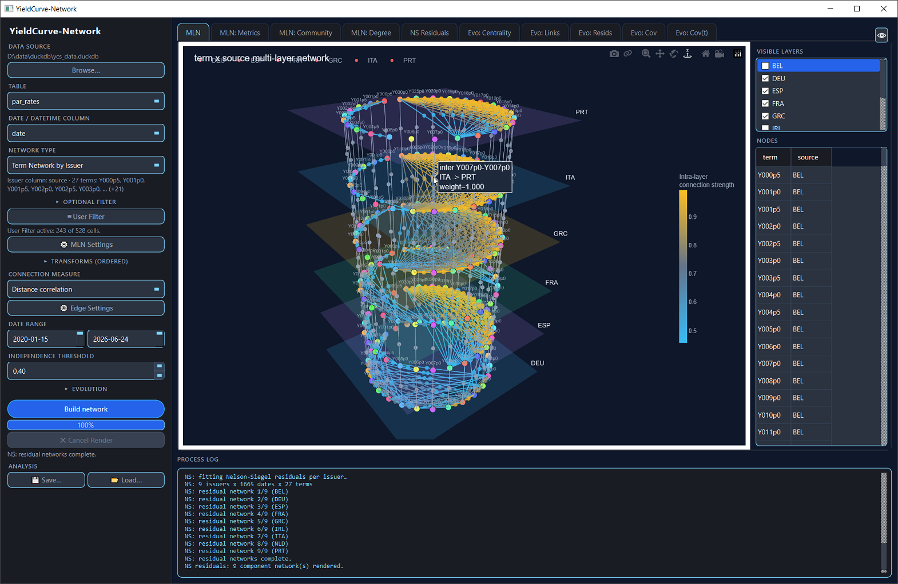 | 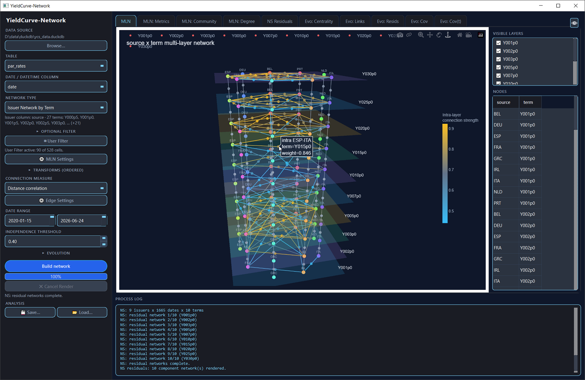 |

| Issuer MLN Centrality  | Issuer MLN Communities |
|:---:|:---:|
| 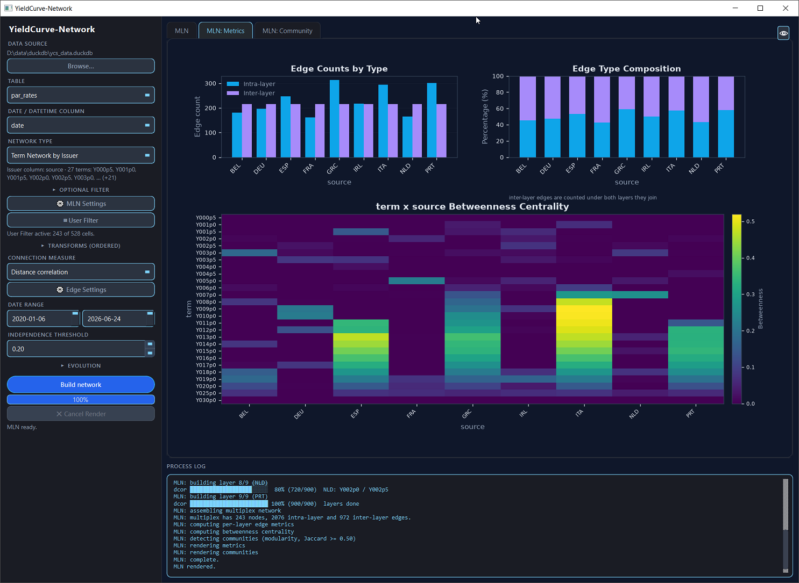 | 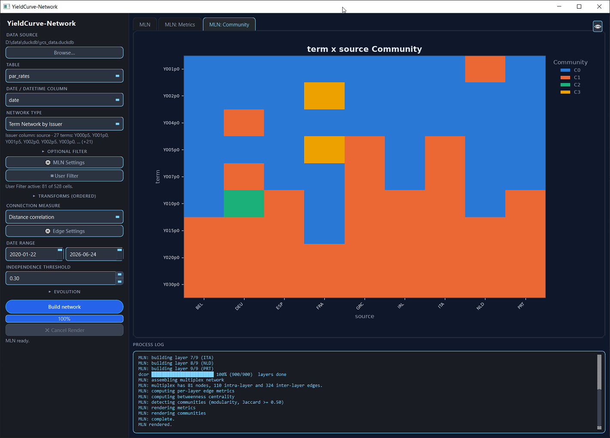 |

| Edge and Community (t)  | NS Residual Metrics |
|:---:|:---:|
| 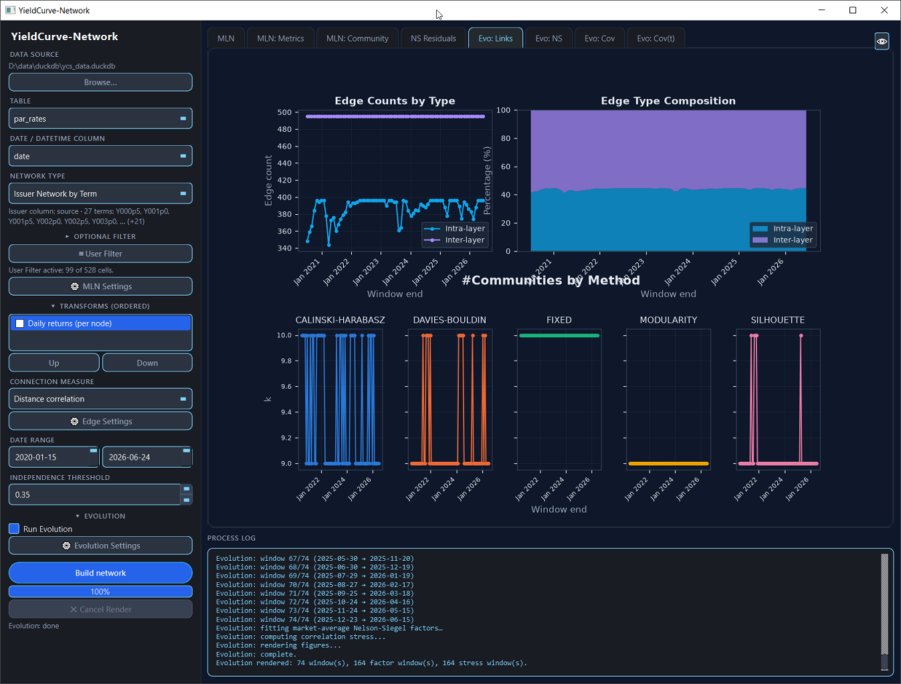 | 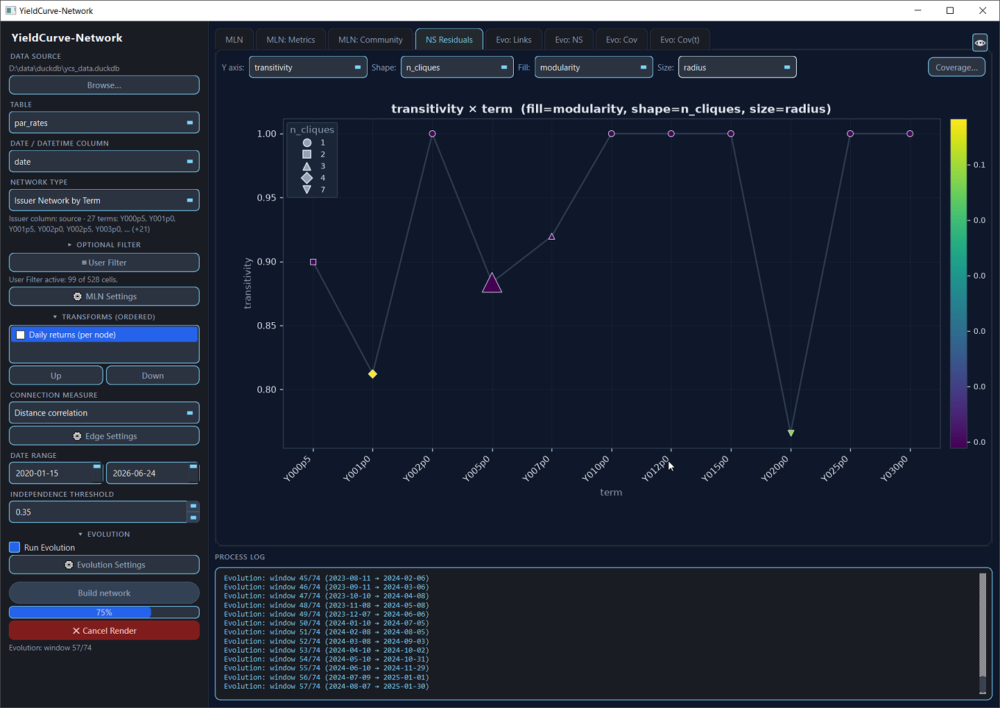 |

| NS Resids (t)  | NS Resids Std (t)  |
|:---:|:---:|
| 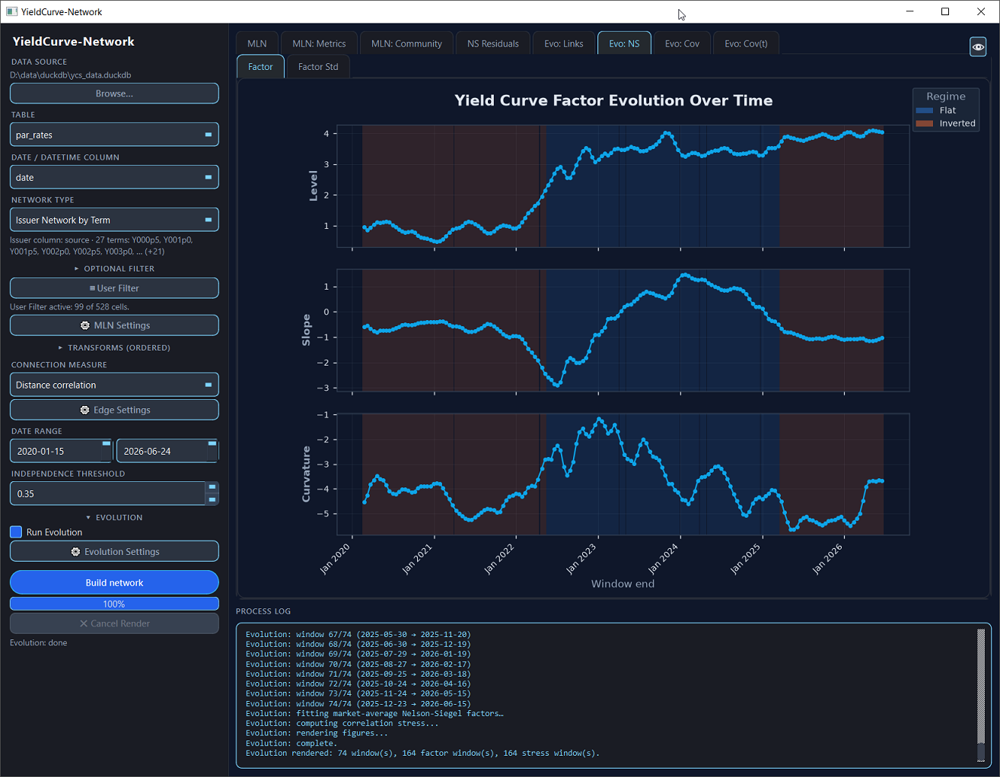 | 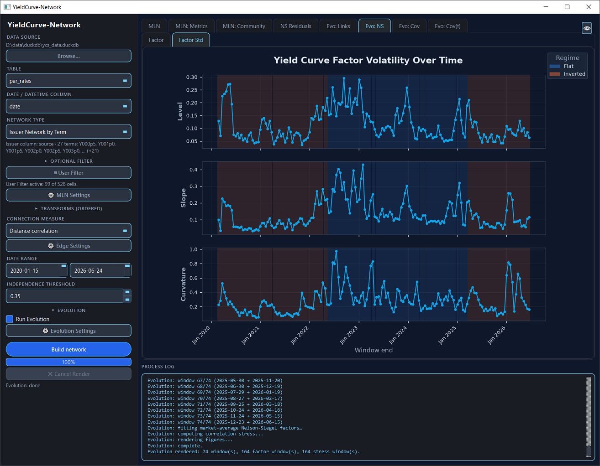 |

| NS Resids Corr (t)  | NS Resids Corr trajectory (t)  |
|:---:|:---:|
| 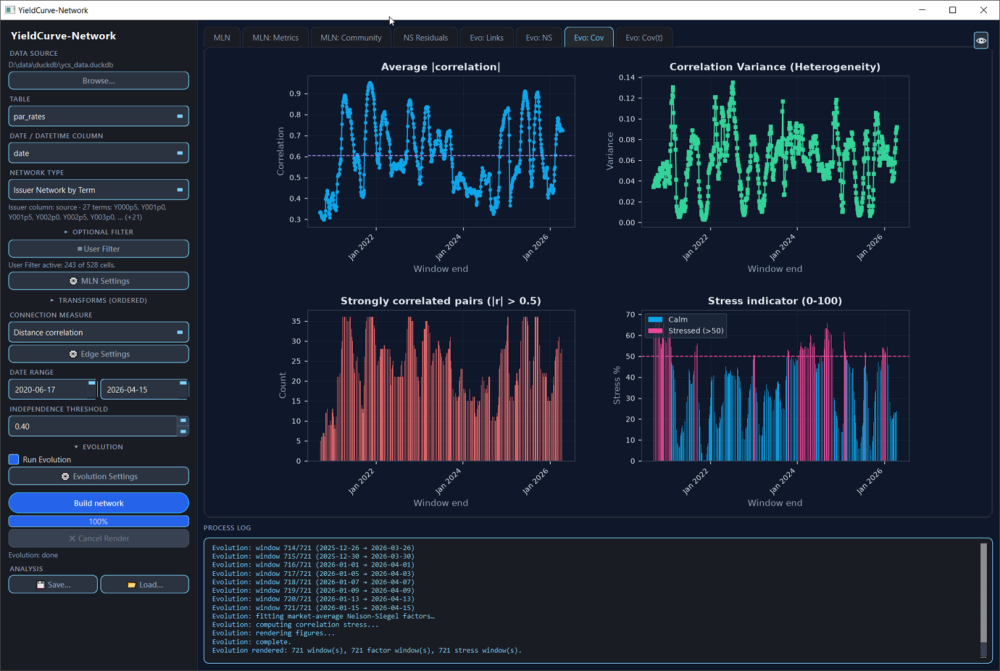 | 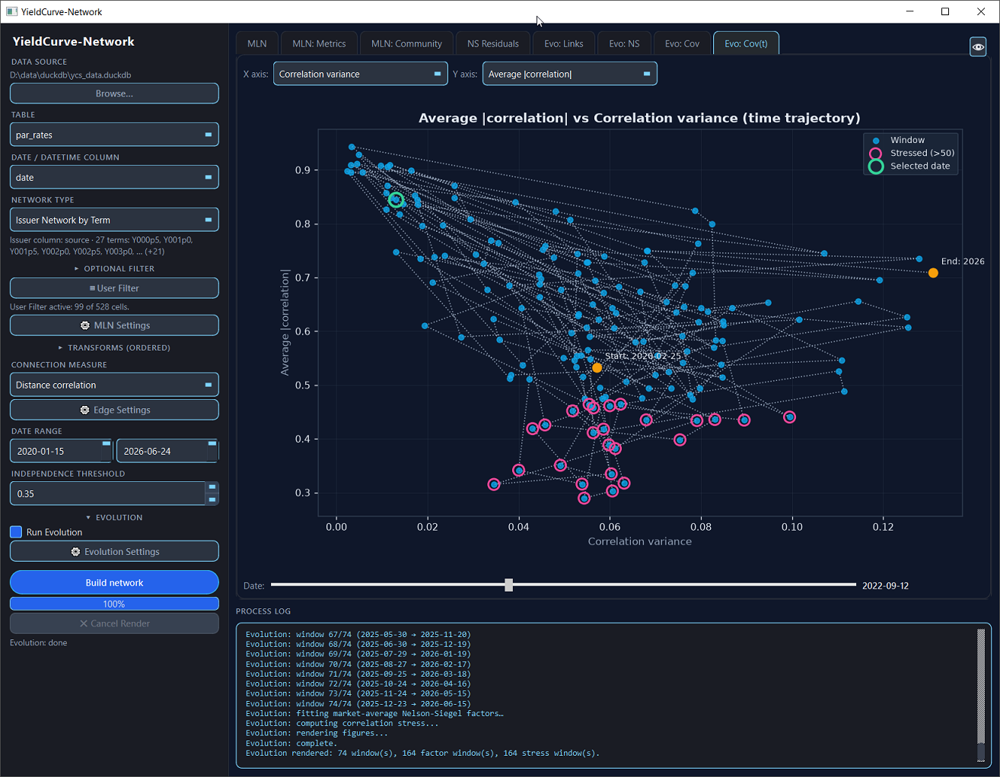 |

| Neural-HJM Resids (t)  | Neural-HJM Resids Corr (t)  |
|:---:|:---:|
| 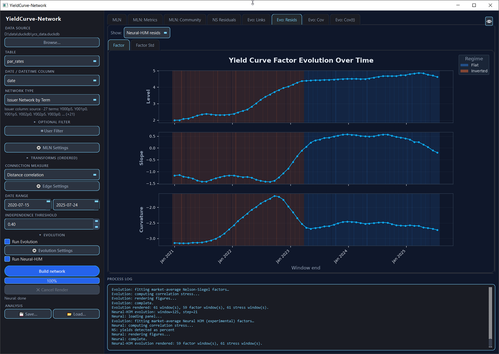 | 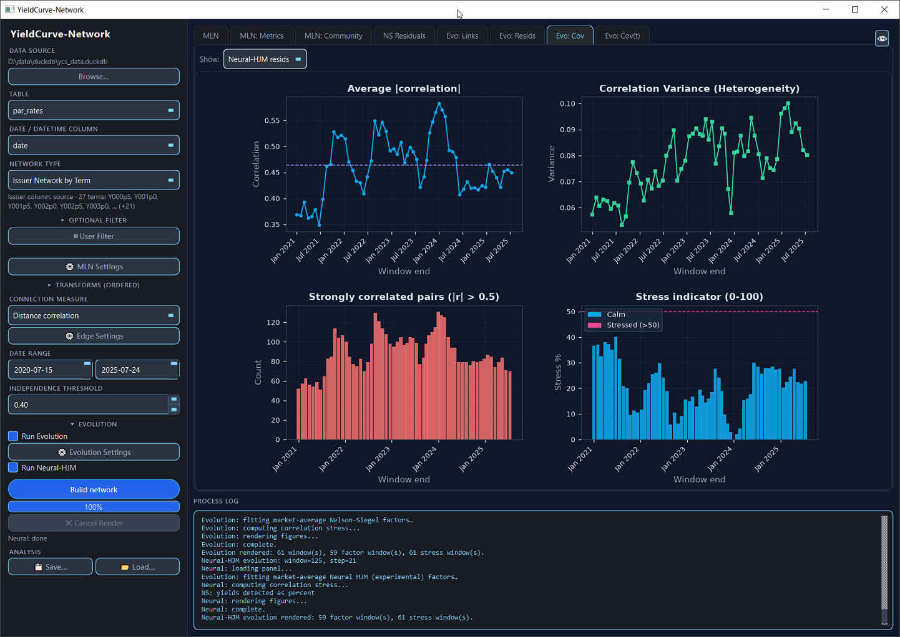 |

### Test data

No curve database to hand? Generate a synthetic one:

```bash
uv run python scripts/make_fake_par_rates.py
# -> data/ycs_fake.duckdb
```

It writes a `par_rates` table in the same wide shape: 15 issuers × 10 terms × ~1250 business days, built from Nelson-Siegel curves whose level/slope/curvature factors follow bloc-correlated random walks, so the networks have genuine community structure rather than noise. Coverage is deliberately ragged — several issuers omit the long or short end, and two start late — which gives the User Filter grid real holes to display.

### Optional: Alternating Conditional Expectations (ACE)

The "Maximal correlation (ACE)" measure depends on [`ace_cream`](https://github.com/FulgentMcGuffin/ace_cream), which compiles a Fortran extension and therefore requires a Fortran compiler (`gfortran`) plus a C compiler at install time. It is kept optional:

```bash
uv sync --extra ace
```

If it is not installed, or its compiled extension fails to import, the GUI omits "Maximal correlation (ACE)" from the connection-measure dropdown and says so in the process log.

## The Data Model

### Expected table shape

```text
par_rates
┌────────────┬────────┬─────────┬─────────┬─────┬─────────┐
│ date       │ source │ 0.5Y    │ 1Y      │ ... │ 30Y     │
├────────────┼────────┼─────────┼─────────┼─────┼─────────┤
│ 2020-01-02 │ DE     │ -0.0061 │ -0.0059 │ ... │  0.0042 │
│ 2020-01-02 │ FR     │ -0.0048 │ -0.0041 │ ... │  0.0089 │
└────────────┴────────┴─────────┴─────────┴─────┴─────────┘
```

### Role inference

Only the **date column** is chosen by hand. Everything else is derived:

- **Term columns** are the numeric columns whose *name* parses as a maturity. Recognised spellings are `0.5Y` / `10Y` / `2.5y`, `6M`, `4W`, `30D`, and the zero-padded `Y000p5` … `Y030p0` form. A text column whose name looks like a term does not qualify — a term column must hold rates.
- **The issuer column** is the first remaining text column (falling back to the first remaining column of any type).

The sidebar reports what was found (`Issuer column: source · 10 terms: 0.5Y, 1Y, 2Y, …`). If a table yields no issuer column or fewer than two term columns it is not a curve panel, **Build network** is disabled, and the reason is stated.

Internally the panel is unpivoted to long `(date, issuer, term, rate)`, and the two network types are expressed purely as a choice of which of those columns supplies nodes and which supplies layers. Nothing in the network or measure code knows about yield curves.

### Maturity ordering

Curve axes sort by maturity everywhere — layer stacks, bar charts, heatmap axes, and the User Filter grid. This matters more than it sounds: alphabetically, `10Y` precedes `1Y` and `0.5Y` precedes `30Y`, so a plain sort renders any curve plot unreadable. Labels that do not parse as a maturity fall back to alphabetical order, so issuer axes are unaffected.

## Filtering the Panel

Three filters compose, applied in this order:

1. **Optional Filter** — tick **WHERE clause** and give a raw SQL boolean expression (e.g. `"source" <> 'GRC'`). It is pushed down into the load query, so the database does the work and the rows never reach Python. Untick it to disable the filter without losing what you typed.
2. **Date range** — seeded from the actual bounds of the chosen date column.
3. **User Filter** — a manual term × issuer cell selection, applied last.

### The User Filter

Curve panels are ragged: an issuer may not quote the short end, may have dropped the 20Y, or may only start part-way through the history. **User Filter** opens a grid of the data that survives the first two filters — terms as rows, issuers as columns — and lets you pick exactly which series take part.

- A cell exists only where the filtered data does. Combinations with no data render as inert blanks, visually distinct from an unchecked cell, and cannot be clicked.
- **Click anywhere in a cell** to toggle it.
- **Click a row or column header** to clear that whole term or issuer — or fill it, if it is already completely empty. The affected row/column flashes so the extent of the change is visible.
- **Shift+click** another header repeats that action across the contiguous range; **Ctrl+click** repeats it on scattered rows/columns. Both propagate the direction of the preceding plain click rather than flipping each section independently, so a group always ends up uniform.
- **Every header shows a `checked/available` count**, so a partially selected row or column is obvious rather than having to be read off the grid.
- **Check all / Uncheck all / Invert** act on every available cell.
- **Term order** and **Issuer order** can be reversed independently, to bring a distant cell within reach on a large panel.
- Everything defaults to checked, so the dialog is opt-out rather than opt-in.

Note that filling a row necessarily re-checks cells you had removed column-by-column (and vice versa) — the header counts are there to make that immediately visible.

Only checked cells reach the network. The selection is a set of `(term, issuer)` **labels**, so it survives a date-range or Optional Filter change: a picked cell that has no data under the new filters simply contributes nothing (never an error), and a cell that becomes newly available renders as an unchecked, pickable box rather than being silently included. It is **discarded only when the table or date column changes** — those redefine what a "term" or "issuer" label even means, unlike a date range or `WHERE` clause, which just change who currently has data. The process log (and the status bar) say when that happens.

| User Filter | 
|:---:|
| 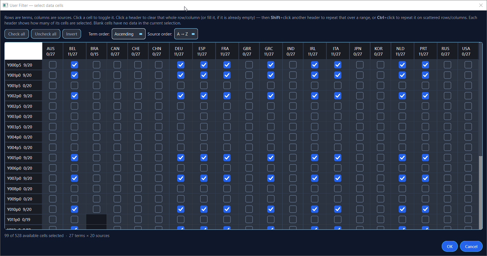 |


## Execution Model

**Build network** runs up to four stages, each on its own worker thread, **one after the other**. Every tab in the window is filled by exactly one of them:

```text
   Build network
        │
        ▼
   ┌─────────────────────────┐  log "MLN:"        ──▶  MLN
   │ 1. Multiplex            │                    ──▶  MLN: Metrics
   │    (always runs)        │                    ──▶  MLN: Community
   └─────────────────────────┘
        │
        ▼
   ┌─────────────────────────┐  log "NS:"         ──▶  NS Residuals
   │ 2. NS residuals         │                         (+ Coverage… pop-up)
   │    (always runs)        │
   └─────────────────────────┘
        │
        ▼  only if "Run Evolution" is ticked
   ┌─────────────────────────┐  log "Evolution:"  ──▶  Evo: Links
   │ 3. Evolution            │                    ──▶  Evo: Resids (NS)
   │    (opt-in, slowest)    │                    ──▶  Evo: Cov (NS)
   └─────────────────────────┘                    ──▶  Evo: Cov(t) (NS)
        │
        ▼  only if "Run Neural-HJM" is also ticked
   ┌─────────────────────────┐  log "Neural:"     ──▶  Evo: Resids (Neural-HJM)
   │ 4. Neural-HJM evolution │                    ──▶  Evo: Cov (Neural-HJM)
   │    (opt-in, slowest)    │                    ──▶  Evo: Cov(t) (Neural-HJM)
   └─────────────────────────┘
```

| # | Stage | Gated by | Cost | Tabs it fills |
|---|---|---|---|---|
| 1 | **Multiplex** | always | `L × O(n_layer²)` measure evaluations | MLN · MLN: Metrics · MLN: Community |
| 2 | **NS residuals** | always | one NS fit per `(issuer, date)` | NS Residuals |
| 3 | **Evolution** | *Run Evolution* | stage 1 repeated per window, ×5 community methods | Evo: Links · Evo: Resids · Evo: Cov · Evo: Cov(t) |
| 4 | **Neural-HJM evolution** | *Run Evolution* **and** *Run Neural-HJM* | stage 3's factor/stress computations, refit under the Neural HJM model | Evo: Resids · Evo: Cov · Evo: Cov(t) (same three tabs, picked via the **Show** dropdown) |

### 1. Multiplex thread

Loads the long panel (SQL `WHERE` → date range → User Filter mask), splits it by layer, applies the transforms *per layer*, computes the pairwise measure, thresholds each layer into a graph, and assembles the multiplex. Then derives per-layer intra/inter edge metrics, the node × layer centrality matrix, and Jaccard-aligned communities.

Fills **MLN** (3D multiplex), **MLN: Metrics**, **MLN: Community** — described under [Multi-Layer Network (MLN) Analysis](#multi-layer-network-mln-analysis).

### 2. NS residuals thread

Starts once the multiplex reports back. It does **not** consume the multiplex — it re-reads the same filtered panel — so it is a separate stage only for scheduling, not for data flow. Fits a Nelson-Siegel curve per `(issuer, date)`, assembles the `(issuer, date, term)` residual cube, and builds one residual correlation network per component-network label, plus the per-issuer coverage spans.

Fills **NS Residuals** and its **Coverage…** pop-up — see [NS Residuals](#ns-residuals).

### 3. Evolution thread

Starts once the NS pass reports back, and only when **Run Evolution** is ticked. It runs three independent computations, and a failure in either of the last two still leaves the first rendered:

| Computation | Feeds |
|---|---|
| Rebuild the whole multiplex in every rolling window; track edge composition and the *k* chosen by each of the five methods | **Evo: Links** |
| Nelson-Siegel factors of the market-average curve + Gaussian-mixture regimes | **Evo: Resids** (*Factor* / *Factor Std*), NS side |
| Rolling stability of the residual correlation structure → stress indicators | **Evo: Cov**, **Evo: Cov(t)**, NS side |

Note that this stage builds **its own** NS residual cube for the stress computation rather than reusing stage 2's. The two are computed twice; sharing them is an obvious future saving.

See [Network Evolution](#network-evolution).

### 4. Neural-HJM evolution thread

Opt-in on top of opt-in: starts once the NS evolution pass reports back (success or failure), and only when both **Run Evolution** and **Run Neural-HJM** are ticked. **Run Neural-HJM** lives in the same EVOLUTION widget group as **Run Evolution**, is disabled until that box is checked, and is greyed out entirely when the optional `neural` extra (`torch`) is not installed.

It repeats the factor-trajectory and correlation-stress halves of stage 3 — *not* the multiplex rebuild, which does not depend on the curve model — fitting the experimental Neural HJM model jointly across the whole series instead of an independent Nelson-Siegel fit per date. This is the slowest stage of the four: it trains one small network per issuer.

Every message this stage logs is prefixed `"Neural:"`. Because there is no per-window loop to report progress through (unlike stage 3's multiplex rebuild), it instead logs one line per issuer as its fit starts, plus a training checkpoint every 25 epochs for both the per-issuer fits and the market-average factor fit — so a slow run still shows continuous, specific progress in the process log rather than several minutes of silence between the stage's start and end messages.

Feeds the same three tabs stage 3 does — **Evo: Resids**, **Evo: Cov**, **Evo: Cov(t)** — as a second, independently selectable dataset; see [the **Show** dropdown](#network-evolution) below.

### Why sequential, and what stays responsive

The stages are queued rather than run in parallel on purpose. All four stages are compute-bound and overwhelmingly *pure Python* — scipy curve fits, networkx traversals, and (for stage 4) small PyTorch training loops — so under the GIL running them together buys no throughput and adds a second thread competing with the one that has to repaint the window. Sequential costs the same wall time and lets the cheap stages land first.

- Worker threads run at **low priority**, so the scheduler favours the GUI.
- Long inner loops take a progress callback purely so they have frequent **cancellation checkpoints** and hand the GIL back; the NS fit is chunked into blocks of dates for exactly this reason.
- **Cancel Render** unwinds whichever stage is running within one checkpoint and clears every tab. If a worker is momentarily between checkpoints the GUI detaches from it instead of blocking, and its results are discarded when it finally exits.
- Only **Build network** is blocked while a run is in flight; the rest of the sidebar stays editable so the next build can be set up.

Every tab has an **eye button** in the top-right that opens the underlying table — Excel-style filters, `Ctrl+C` copy, and CSV/Parquet export of the displayed data.

## Saving and Reloading an Analysis

A finished run can be written to a single `.ycn` file and reopened later — every tab exactly as it was rendered, plus the settings that produced it.

- **💾 Save…** (`Ctrl+S`) — enabled as soon as anything has rendered. Writes whichever stages ran; a run without evolution simply stores fewer tables.
- **📂 Load…** (`Ctrl+O`) — repopulates every tab and restores the sidebar. **Nothing is recomputed**: the stored tables *are* the result. The settings come back too, so pressing **Build network** re-runs exactly what produced the file.

### What is in the file

A `.ycn` is an ordinary **zip archive**:

```text
manifest.json          format version, timestamp, settings, per-stage scalars
frames/<stage>.<name>.parquet
```

**Figures are not stored.** Every figure in this application is a pure function of a frame plus the settings, so re-rendering on load is exact. That keeps archives small — a full three-stage run over a 15 × 10 panel is around 30 KB — makes them robust to a matplotlib upgrade, and means loading a session **executes no code from the file**: there is nothing pickled in it. The manifest is plain JSON, so an archive stays inspectable with a text editor and its tables readable by anything that can open Parquet.

The format is versioned. An archive written by a newer build is refused with an explanation rather than mis-parsed, and a file that is not a session at all is reported plainly.

A restored session shows the settings that produced it, but does **not** re-read the database — if the underlying table has changed since, the tabs still show what was saved. Press **Build network** to bring it up to date.

## Multi-Layer Network (MLN) Analysis

### Anatomy of the Multiplex

- **Nodes** are `(node, layer)` pairs. `DE` at `2Y` and `DE` at `10Y` are distinct vertices.
- **Intra-layer edges** come from the connection network computed *within* that layer, pruned by the independence threshold. Edge strength is the connection measure itself.
- **Inter-layer edges** join the same node across every pair of layers it appears in. Maturities have a natural order, but the multiplex does not restrict these to adjacent layers — a node present in eight terms is linked across all 28 pairs.

**Transforms are applied per layer, not globally.** `daily_returns` computes `pct_change` grouped by node; since a node appears in many layers, transforming the pooled frame would compute returns across interleaved rows from different layers. The MLN subsets by layer first, then transforms, then pivots.

Layers may share few nodes, or none — that is a property of the data, not a fault. When no node appears in more than one layer the process log says so explicitly, so an empty inter-layer set never reads as a bug.

### MLN Settings

| Setting | Default | Meaning |
|---------|---------|---------|
| **Centrality measure** | eigenvector | Centrality shown in the node × layer heatmap: `eigenvector`, `betweenness`, or `degree` |
| **Jaccard similarity** | 0.60 | Minimum member overlap for two per-layer communities to be treated as the *same* community across layers |
| **Community method** | fixed | k-selection strategy per layer (see below) |
| **Max communities** | 10 | For `fixed`: exact k per layer. For the optimisation methods: upper bound of the search. Also the ceiling on the total distinct communities **MLN: Community** shows after cross-layer alignment — see below. |

Alongside it, the main sidebar carries the **connection measure** (plus measure-specific **Edge Settings**, e.g. the stress-regime quantile for conditional correlation), the **transforms**, the **date range**, and the **independence threshold** (default 0.33 — keep edges where the measure ≥ threshold).

### Community Detection Methods

Communities are assigned within each layer using **Adjacency Spectral Embedding (ASE)** followed by **KMeans clustering**. Five strategies determine the number of communities (*k*) independently per layer:

1. **FIXED** — a fixed *k* for every layer. Simplest and most reproducible; useful for enforcing a prior ("partition every term into 4 blocs").
2. **SILHOUETTE** — maximizes the average silhouette coefficient in the latent (ASE) embedding, balancing intra-cluster cohesion against inter-cluster separation.
3. **MODULARITY** — maximizes modularity in the **original network** rather than latent space; directly optimizes a classical graph-partitioning objective.
4. **DAVIES-BOULDIN** — minimizes the Davies-Bouldin index in latent space, penalizing overlapping or poorly-separated clusters.
5. **CALINSKI-HARABASZ** — maximizes the ratio of between-cluster to within-cluster variance; tends to favour balanced partitions.

#### Cross-Layer Community Alignment

Detection is **independent within each layer** — no information crosses the layer boundary, which is what makes per-layer structure honest. But it also means cluster label `0` in the 2Y layer has nothing to do with label `0` in the 10Y layer.

The **Jaccard threshold** repairs this. After detection, each layer's communities are matched against those already seen using Hungarian assignment on Jaccard overlap of their member sets. Two communities in different layers receive the same global ID when their overlap reaches the threshold; anything below it, and anything unmatched, gets a fresh ID.

The consequence is that **a colour means the same group of nodes in every layer**, which is the only thing that makes the community heatmap readable across columns. Raise the threshold to demand stronger evidence before declaring two communities equivalent (yielding more, finer communities); lower it to merge more aggressively.

Per-layer detection is independent, so without a further check a long run of poorly-overlapping layers could mint far more *aligned* ids than **Max communities** allows — each layer only respects that cap for its own cluster count. **Max communities** therefore also caps the total distinct ids handed out across the whole alignment: once the budget is spent, the largest unmatched clusters still get their own id first, and anything left over attaches to whichever existing community it resembles most, even below the Jaccard threshold, rather than spawning an unbounded number of new ones.

### The MLN Tabs

These three are filled by [stage 1](#1-multiplex-thread).

#### MLN — Interactive 3D Multiplex

An interactive Plotly view: one translucent plane per layer, nodes arranged on a shared circle so a node keeps the same angular position in every layer, intra-layer edges coloured by connection strength, and vertical inter-layer links where nodes are shared.

- **Rotate, pan and zoom** the stack directly.
- **Hover** any node or edge for its identity, layer and weight.
- **Visible layers** checklist toggles layers in and out. Re-rendering reuses the already-computed multiplex, so toggling is immediate and never recomputes the networks. The checked subset is remembered across a rebuild (e.g. re-running just to also tick "Run Evolution") and restored rather than reset to "all checked", as long as the same layer values reappear.
- **Node table** beside the view lists every `(node, layer)` pair; clicking a node in the 3D graph selects and scrolls to its row.

#### MLN: Metrics

A composite figure: the top third carries per-layer **edge counts** (intra versus inter) and the **intra/inter composition**, the lower two-thirds a **node × layer centrality heatmap** using the centrality chosen in MLN Settings. Cells for a node absent from a layer are greyed rather than drawn as a low value, so absence and low centrality stay visually distinct.

An inter-layer edge touches two layers and is therefore counted under both in the per-layer chart; the figure states this beneath the composition panel.

#### MLN: Community

The node × layer community heatmap, coloured by the **Jaccard-aligned global community ID**. Reading across a row shows whether a node keeps its community across layers; reading down a column shows how a layer partitions.

Colours come from a 10-colour curated palette that matches the notebooks, extended automatically (via `tab20`/`tab20b`, then a sampled continuous colormap as a last resort) whenever there are more communities than that to distinguish — so raising **Max communities** past 10 does not start repeating colours across unrelated communities.

### Performance Considerations

- Cost is `L × O(n_layer²)` measure evaluations for `L` layers. Layering is usually *cheaper* than one pooled network, since `(Σnᵢ)² > Σnᵢ²`.
- **Issuer Network by Term** is the cheaper direction on a typical panel: ~10–15 term layers over ~15–40 issuer nodes. **Term Network by Issuer** inverts that — many small layers — and the log warns past 12 layers.
- Expensive measures (distance correlation, mutual information) multiply across layers. Prefer Spearman, Kendall Tau or Chatterjee ξ while exploring, then re-run with the expensive one.
- **Smoke test first**: run on a truncated date range before committing to full history.

## NS Residuals

A curve panel is dominated by its level/slope/curvature factors: raw rates across issuers co-move so strongly that a correlation network is nearly complete and says little. Fitting a Nelson-Siegel curve to each issuer and networking the **residuals** instead shows who actually deviates together.

One residual network is built per component network — per maturity for *Issuer Network by Term*, per issuer for *Term Network by Issuer* — from the same `(issuer, date, term)` residual cube. The tab charts one network-level metric across those labels, with four live pickers:

| Picker | Eligible columns | Default |
|---|---|---|
| **Y axis** | any numeric metric | `modularity` |
| **Shape** | boolean, text, or integer with ≤10 distinct values | `is_connected` |
| **Fill** | any numeric metric (drives the colour bar) | `modularity` |
| **Size** | any numeric metric | `avg_eccentricity` |

Title, axis label, legend and colour bar all follow the selection. **Coverage…** opens the per-issuer observation spans, which is the quickest way to see whether a network excluded someone for lack of data.

This is [stage 2](#2-ns-residuals-thread): a single snapshot over the configured date range, not an evolution, so it lands quickly.

## Network Evolution

[Stage 3](#3-evolution-thread). Tick **Run Evolution** to rebuild the whole multiplex inside every rolling window and track how it changes. Four tabs:

- **Evo: Links** — intra/inter edge counts and composition over time, and the community count *k* that each of the five k-selection methods picks per window. Because each window's *k* depends only on that window, there is no lookahead.
- **Evo: Resids** — *Factor* and *Factor Std* sub-tabs: level, slope and curvature of the market-average curve and their within-window volatility, shaded by a Gaussian-mixture regime label.
- **Evo: Cov** — the four correlation-stress indicators, one per quadrant: average |correlation|, its variance, the count of strongly correlated pairs, and a 0–100 stress indicator.
- **Evo: Cov(t)** — a dotted time trajectory through any two of those four series. Stressed windows (indicator > 50) are ringed and the endpoints are labelled. Selection is **bidirectional**: drag the date slider to walk a cursor along the path, or click a point on the chart to jump the slider to that date. The two axes can never carry the same series: picking the one already on the other axis swaps them.

All four tabs use the **window size and step from the Evolution Settings dialog** — the multiplex windows, the factor trajectories and the stress indicators alike. A smaller step gives proportionally more points on every one of them.

Bear in mind that the step controls cost as well as resolution: halving it doubles the number of multiplex rebuilds, and each rebuild is a full set of per-layer correlation matrices plus five community detections.

This is much slower than a single multiplex — it is `n_windows` multiplex builds plus five community detections each — which is why it is opt-in and runs after stage 2.

### Switching curve models: the Show dropdown

When [stage 4](#4-neural-hjm-evolution-thread) has also run (**Run Evolution** *and* **Run Neural-HJM** both ticked), **Evo: Resids**, **Evo: Cov** and **Evo: Cov(t)** each gain a **Show** dropdown: **NS Resids** / **Neural-HJM resids**. It selects which model's factor trajectory and stress indicators those three tabs display — the multiplex structure in **Evo: Links** is unaffected, since edge composition and community count depend only on the connection measure, not on which curve model produced the residuals.

The three dropdowns stay in lock-step (changing one moves the others), "Neural-HJM resids" is disabled until that stage actually finishes, and the **eye button** always exports whichever dataset is currently shown.

## References

### Project Foundations & Libraries

* **graspologic (Python 3.13 Compatible Fork)**: Graph statistical algorithms optimized for modern Python and dependency stacks: [GitHub Repository](https://github.com/FulgentMcGuffin/graspologic).
* **NetworkX**: Network analysis and graph structures: [Official Site](https://networkx.org/) | [GitHub](https://github.com/networkx/networkx).
* **Polars**: High-performance, multi-threaded dataframe execution engine: [Documentation](https://docs.pola.rs/) | [GitHub](https://github.com/pola-rs/polars).
* **plotnine**: Grammar-of-graphics plotting used by the notebooks (`ggplot`-style layered charts): [Documentation](https://plotnine.org/) | [GitHub](https://github.com/has2k1/plotnine).
* **DuckDB**: In-process analytical database used as the primary backend: [Documentation](https://duckdb.org/docs/) | [GitHub](https://github.com/duckdb/duckdb).
* **Plotly**: Interactive, browser-rendered 3D graphing used for the multiplex view: [Documentation](https://plotly.com/python/) | [GitHub](https://github.com/plotly/plotly.py).
* **MultiLayerNetViz**: 3D multiplex visualization this project's MLN view is derived from: [GitHub Repository](https://github.com/FulgentMcGuffin/MultiLayerNetViz).

### Yield Curves & Term Structure

* **Yield Curve**: The term structure of interest rates: [Wikipedia](https://en.wikipedia.org/wiki/Yield_curve).
* **Par Yield / Par Rate**: The coupon rate at which a bond prices at par, and the curve built from it: [Wikipedia](https://en.wikipedia.org/wiki/Par_yield).
* **Nelson-Siegel Model**: Parsimonious level/slope/curvature parameterisation of the yield curve, used by this project's synthetic data generator: [Wikipedia](https://en.wikipedia.org/wiki/Fixed-income_attribution#Modeling_the_yield_curve).
  - **Foundational Paper**: Nelson, C. R., & Siegel, A. F. (1987). *"Parsimonious Modeling of Yield Curves."* The Journal of Business, 60(4), 473-489: [DOI (JSTOR)](https://www.jstor.org/stable/2352957).
  - **Dynamic Extension**: Diebold, F. X., & Li, C. (2006). *"Forecasting the term structure of government bond yields."* Journal of Econometrics, 130(2), 337-364: [DOI (Elsevier)](https://doi.org/10.1016/j.jeconom.2005.03.005).

### Statistical Relationships & Correlation

* **Distance Correlation**: Capturing linear and non-linear association: [Wikipedia](https://en.wikipedia.org/wiki/Distance_correlation).
* **Pearson Correlation Coefficient**: Evaluating linear correlation: [Wikipedia](https://en.wikipedia.org/wiki/Pearson_correlation_coefficient).
* **Spearman's Rank Correlation Coefficient**: Monotonic relationship strength: [Wikipedia](https://en.wikipedia.org/wiki/Spearman%27s_rank_correlation_coefficient).
* **Kendall's Rank Correlation Coefficient (τ)**: Rank-based concordance measure robust to ties: [Wikipedia](https://en.wikipedia.org/wiki/Kendall_rank_correlation_coefficient).
* **Mutual Information**: Entropy-based measure of shared information between variables: [Wikipedia](https://en.wikipedia.org/wiki/Mutual_information).
* **Chatterjee's ξ (Xi) Correlation**: Rank-based correlation coefficient detecting any association: [arXiv](https://arxiv.org/abs/1909.10140).
* **Alternating Conditional Expectations (ACE)**: Nonparametric maximal-correlation transformation, per the "Bivariate case": [Wikipedia](https://en.wikipedia.org/wiki/Alternating_conditional_expectations).
  - **Implementation**: [ace_cream (Python 3.13 Compatible Fork)](https://github.com/FulgentMcGuffin/ace_cream).
  - **Foundational Paper**: Breiman, L., & Friedman, J. H. (1985). *"Estimating Optimal Transformations for Multiple Regression and Correlation."* Journal of the American Statistical Association, 80(391), 580-598: [DOI (Taylor & Francis)](https://doi.org/10.1080/01621459.1985.10478157).

### Robust and Specialized Correlation Methods

* **Shrinkage Correlation (Ledoit-Wolf)**: Denoised correlation via Random Matrix Theory for high-dimensional, short-window settings: [Wikipedia](https://en.wikipedia.org/wiki/Shrinkage_(statistics)).
  - **Reference**: Ledoit, O., & Wolf, M. (2004). *"Honey, I shrunk the sample covariance matrix."* Journal of Portfolio Management, 30(4), 110-119.
* **Conditional / Exceedance Correlation**: Correlation measured only during stress regimes (extreme moves) versus calm periods; captures tail co-movement and crisis linkage.

### Community Detection & Clustering

* **Silhouette Coefficient**: Average silhouette width for cluster cohesion and separation: [Wikipedia](https://en.wikipedia.org/wiki/Silhouette_(clustering)).
* **Modularity Optimization**: Maximizing community structure in networks: [Wikipedia](https://en.wikipedia.org/wiki/Modularity_(networks)).
  - **Reference**: Newman, M. E. (2006). *"Modularity and community structure in networks."* Proceedings of the National Academy of Sciences, 103(23), 8577-8582: [DOI (PNAS)](https://doi.org/10.1073/pnas.0601602103).
* **Davies-Bouldin Index**: Average similarity ratio between each cluster and its most similar cluster: [Wikipedia](https://en.wikipedia.org/wiki/Davies%E2%80%93Bouldin_index).
  - **Reference**: Davies, D. L., & Bouldin, D. W. (1979). *"A Cluster Separation Measure."* IEEE Transactions on Pattern Analysis and Machine Intelligence, 1(4), 224-227: [DOI (IEEE)](https://doi.org/10.1109/TPAMI.1979.4766909).
* **Calinski-Harabasz Index**: Ratio of between-cluster to within-cluster variance: [Wikipedia](https://en.wikipedia.org/wiki/Calinski%E2%80%93Harabasz_index).
  - **Reference**: Caliński, T., & Harabasz, J. (1974). *"A Dendrite Method for Cluster Analysis."* Communications in Statistics, 3(1), 1-27: [DOI (Taylor & Francis)](https://doi.org/10.1080/03610927408827101).
* **Spectral Clustering & ASE**: Adjacency Spectral Embedding for latent-space node clustering: [graspologic Documentation](https://graspologic.readthedocs.io/).

### Multi-Layer / Multiplex Networks

* **Multilayer Networks (survey)**: The formal framework for networks composed of multiple interacting layers, including multiplex networks where the same nodes recur across layers: [Wikipedia](https://en.wikipedia.org/wiki/Multidimensional_network).
  - **Foundational Survey**: Kivelä, M., Arenas, A., Barthelemy, M., Gleeson, J. P., Moreno, Y., & Porter, M. A. (2014). *"Multilayer networks."* Journal of Complex Networks, 2(3), 203-271: [DOI (Oxford)](https://doi.org/10.1093/comnet/cnu016) | [arXiv](https://arxiv.org/abs/1309.7233).
  - **Structure and Dynamics**: Boccaletti, S., et al. (2014). *"The structure and dynamics of multilayer networks."* Physics Reports, 544(1), 1-122: [DOI (Elsevier)](https://doi.org/10.1016/j.physrep.2014.07.001).

### Community Alignment Across Layers

* **Jaccard Index**: Set-overlap similarity used to decide when two per-layer communities represent the same group: [Wikipedia](https://en.wikipedia.org/wiki/Jaccard_index).
* **Hungarian (Kuhn-Munkres) Algorithm**: Optimal one-to-one assignment, used here to match each layer's communities against those already seen: [Wikipedia](https://en.wikipedia.org/wiki/Hungarian_algorithm).
  - **Reference**: Kuhn, H. W. (1955). *"The Hungarian method for the assignment problem."* Naval Research Logistics Quarterly, 2(1-2), 83-97: [DOI (Wiley)](https://doi.org/10.1002/nav.3800020109).
  - **Implementation**: [`scipy.optimize.linear_sum_assignment`](https://docs.scipy.org/doc/scipy/reference/generated/scipy.optimize.linear_sum_assignment.html).

### Temporal Evolution

* **Omnibus Embedding**: Simultaneously embedding multiple matched-vertex graphs into a common canonical coordinate system: [graspologic Tutorial](https://graspologic-org.github.io/graspologic/tutorials/embedding/Omnibus.html).
  - **Foundational Paper**: Levin, K., Athreya, A., Tang, M., Lyzinski, V., & Priebe, C. E. (2017). *"A central limit theorem for an omnibus embedding of multiple random graphs and implications for multiscale network inference."* [arXiv:1705.09355](https://arxiv.org/abs/1705.09355).
* **Holm-Bonferroni Method**: Sequentially rejective procedure controlling family-wise error rates, for change-point detection across consecutive windows: [Wikipedia](https://en.wikipedia.org/wiki/Holm%E2%80%93Bonferroni_method).
  - **Foundational Paper**: Holm, S. (1979). *"A simple sequentially rejective multiple test procedure."* Scandinavian Journal of Statistics, 6(2), 65-70: [JSTOR](https://www.jstor.org/stable/4615733).
